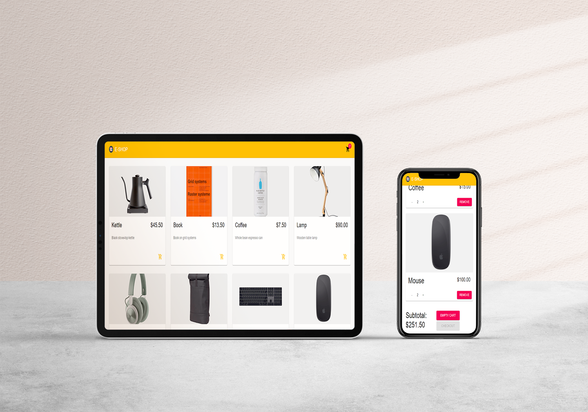

# E-SHOP

## Description

E-SHOP is an online shop web application. It was built using React, Commerce.js, and Material UI. In this web app, users can browse products and add items to the cart. After finishing shopping, users can checkout and fill in their card details to pay for the products.

## Library Directory 📙

| Contents                    |
| --------------------------- |
| [Screenshot](#screenshot)   |
| [Live Demo](#live-demo)     |
| [Built With](#built-with-🛠) |
| [Setup](#setup-⏳)          |
| [Authors](#authors)         |
| [License](#license)         |

## Live Demo

[Live demo](https://my-eshop-2021.herokuapp.com/)

## Screenshot



## Built With 🛠

```
- React.js
- Commerce.js
- ES6
- React Material UI
```

## Setup ⏳

> Follow these steps to setup this web application locally :

1. - [ ] Open your `Terminal`.
2. - [ ] Navigate to the directory where you will like to install the repo by running `cd FOLDER-NAME`
3. - [ ] Run `git clone git@github.com:khalilhamdii/e-shop.git` in the terminal to download.
4. - [ ] Run `cd e-shop` to enter directory.
5. - [ ] Run `npm install` to install node packages and dependencies.
6. - [ ] Run `npm start` in your browser to start the application.

## Authors

### 👨‍💻 Khalil Hamdi

[](https://github.com/khalilhamdii) <br>
[](https://www.linkedin.com/in/khalilhamdi/) <br>
[](mailto:khaalil.hamdi@gmail.com) <br>
[](https://twitter.com/Khalilhamdiii)

### 🤝 Contributing

Contributions, issues and feature requests are welcome!

Feel free to check the [issues page](https://github.com/khalilhamdii/e-shop).

### Show your support

Give a ⭐️ if you like this project!

### License


